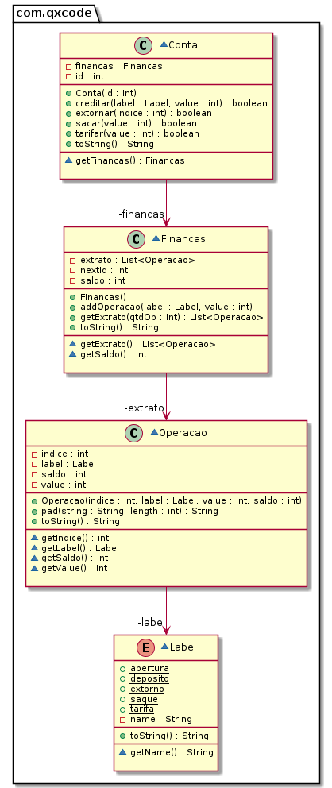

# Tarifas - Agência 1


<!--TOC_BEGIN-->
- [Requisitos](#requisitos)
- [Shell](#shell)
- [Diagrama UML](#diagrama-uml)
- [Esqueleto](#esqueleto)
<!--TOC_END-->

O objetivo dessa atividade é implementar uma classe responsável por gerenciar a conta bancária de um único cliente. Faremos operações de saque, depósito e extrato.

## Requisitos

- **Iniciar**
    - Iniciar a conta passando número da conta.
    - Se a conta já existir, resete todos os valores para uma nova conta.
    - Inicia a conta com a operação de "abertura".
    - Para facilitar a visualização dos dados, utilize inteiros para registrar as operações financeiras.
- **Saque, Depósito e Tarifas**
    - Verifique se o valor é válido.
    - No caso da tarifa, o valor final de saldo poderá ser negativo.
    - No caso do saque, verifique se há saldo suficiente efetuar a operação. 
- **Retornar o extrato**.
    - Extrato completo
        - Retornar todas as movimentações da conta desde a abertura
        - A descrição pode ser "abertura", "saque", "deposito", "tarifa", "extorno".
        - Os saques devem ter valor negativo e os depósitos positivos.
- **Extrato parcial**
      - Mostre as últimas N operações do extrato.
- **Extornar tarifas**.
    - Deve ser possível extornar, pagando de volta, tarifas passando uma lista de índices.
    - Apenas efetue a operação de extorno dos índices válidos que forem tarifas.

***
## Shell

```bash
#__case iniciar
$init 100
$show 
conta:100 saldo:0

#__case depositar
$deposito 100
$deposito -10
fail: valor invalido
$show
conta:100 saldo:100

#__case debito
$saque 20
$tarifa 10
$show
conta:100 saldo:70
$saque 150
fail: saldo insuficiente
$saque 30
$tarifa 5
$deposito 5
$tarifa 1
$show
conta:100 saldo:39

#__case extrato
#extrato mostra todas as operações desde a abertura da conta
$extrato
 0: abertura:    0:    0
 1: deposito:  100:  100
 2:    saque:  -20:   80
 3:   tarifa:  -10:   70
 4:    saque:  -30:   40
 5:   tarifa:   -5:   35
 6: deposito:    5:   40
 7:   tarifa:   -1:   39

#__case extrato n
#extratoN mostra as ultimas N operacoes
$extratoN 2
 6: deposito:    5:   40
 7:   tarifa:   -1:   39

#__case extornar
$extornar 1 5 7 50
fail: indice 1 nao e tarifa
fail: indice 50 invalido

#__case novo extrato
$extrato
 0: abertura:    0:    0
 1: deposito:  100:  100
 2:    saque:  -20:   80
 3:   tarifa:  -10:   70
 4:    saque:  -30:   40
 5:   tarifa:   -5:   35
 6: deposito:    5:   40
 7:   tarifa:   -1:   39
 8:  extorno:    5:   44
 9:  extorno:    1:   45

#__case extrato tarifa
$tarifa 50
$extratoN 2
 9:  extorno:    1:   45
10:   tarifa:  -50:   -5

$end
```

***
## Diagrama UML


***
## Esqueleto
<!--FILTER Solver.java java-->
```java
//Essa enumeração guarda possíveis labels para as operações.
enum Label {
    saque("saque"), 
    deposito("deposito"), 
    tarifa("tarifa"), 
    extorno("extorno"), 
    abertura("abertura");
    
    private String name;
    //nas enums o Construtor tem que ser privado
    private Label(String name) {
        this.name = name;
    }
    public String getName() {
        return this.name;
    }
    public String toString() {
        return this.name;
    }
}
//Operação guarda os dados de uma única operação.
class Operacao {
    private int indice;    
    private Label label;
    //O valor em negativo se for débito
    private int value;
    //O saldo residual
    private int saldo;
    public Operacao(int indice, Label label, int value, int saldo) {
        this.indice = indice;
        this.label = label;
        this.value = value;
        this.saldo = saldo;
    }
    //faz o preenchimento da string com espaços em branco até completar o length
    public static String pad(String string, int length) {
        return String.format("%1$"+length+ "s", string);
    }
    public String toString() {
        return pad("" + indice, 2) + ":" + pad("" + label, 9) + ":" + pad("" + value, 5) + ":" + pad("" + saldo, 5);
    }
    public int getIndice() {
        return this.indice;
    }
    public Label getLabel() {
        return this.label;
    }
    public int getValue() {
        return this.value;
    }
    public int getSaldo() {
        return this.saldo;
    }
};
//Finanças registra o saldo e guarda as movimentações financeiras
class Financas {
    //O id da próxima operação dessa conta
    private int nextId;
    //A lista de operações realizadas
    private List<Operacao> extrato;
    private int saldo;
    public Financas();
    //Adiciona value ao saldo
    //Crie operação e adiciona ao vetor de operações
    //Incrementa o nextId
    public void addOperacao(Label label, int value);
    public int getSaldo();
    public List<Operacao> getExtrato();
    List<Operacao> getExtrato(int qtdOp);
}
class Conta {
    //O número da conta
    private int id;
    private Financas financas;
    public Conta(int id);
    //só realiza a operação se houver dinheiro suficiente na conta
    public boolean sacar(int value);
    //retira o dinheiro, mesmo que o saldo fique negativo
    public boolean tarifar(int value);
    //se o índice for válido e representar uma operação de tarifa
    //adicione o mesmo valor tarifado, mas com label de extorno
    public boolean extornar(int indice);
    //adiciona valor à conta
    public boolean creditar(Label label, int value);
    public String toString();
    public Financas getFinancas();
}
class Solver{
    public static void main(String[] args) {
        Scanner scanner = new Scanner(System.in);
        Conta conta = new Conta(0);
        while(true){
            String line = scanner.nextLine();
            System.out.println("$" + line);
            String ui[] = line.split(" ");
            if(line.equals("end")) {
                break;
            } else if(ui[0].equals("show")) {
                System.out.println(conta);
            } else if(ui[0].equals("init")) {
                conta = new Conta(Integer.parseInt(ui[1]));
            } else if(ui[0].equals("saque")) {
                conta.sacar(Integer.parseInt(ui[1]));
            } else if(ui[0].equals("tarifa")) {
                conta.tarifar(Integer.parseInt(ui[1]));
            } else if(ui[0].equals("deposito")) {
                conta.creditar(Label.deposito, Integer.parseInt(ui[1]));
            } else if(ui[0].equals("extornar")) {
                for(int i = 1; i < ui.length; i++)
                    conta.extornar(Integer.parseInt(ui[i]));
            } else if(ui[0].equals("extrato")) {
                for(Operacao op : conta.getFinancas().getExtrato())
                    System.out.println(op);
            } else if(ui[0].equals("extratoN")) {
                for(Operacao op : conta.getFinancas().getExtrato(Integer.parseInt(ui[1])))
                    System.out.println(op);
            } else {
                System.out.println("fail: comando invalido");
            }
        }
        scanner.close();
    }
}
```
<!--FILTER_END-->

