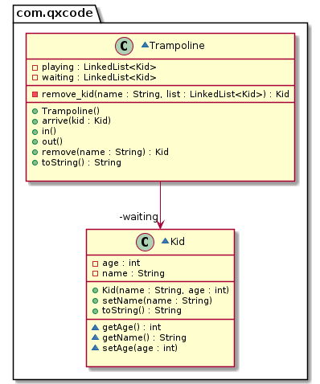

# Pula pula no parquinho

<!--TOC_BEGIN-->
- [Requisitos](#requisitos)
- [Opcional](#opcional)
- [Shell](#shell)
- [Diagrama](#diagrama)
- [Main não interativa](#main-não-interativa)
<!--TOC_END-->


Nosso objetivo no trabalho é modelar um gestor de pula pulas em um parquinho.

## Requisitos
- Inserir crianças na fila de espera do pula pula
- Mover a primeira criança da fila de espera do pula pula para dentro do pula pula.
- Mover a primeira criança que entrou no pula pula para o final da fila de espera.

## Opcional
```sh
$saldo _nome
$caixa
# Cada vez que a criança anda no pula pula e sai, a conta dela aumenta e quando ela vai embora, ela dá dinheiro aumentando o dinheiro do pula pula.
# saldo mostra o valor que uma criança deve acumulado.
# caixa mostra quanto dinheiro o pula pula já arrecadou.
$papaichegou _nome
# O pai dele chegou, então você busca a criança seja da fila de entrada ou de dentro do pula pula e retira do brinquedo.
$fechar
# retira todas as criancas do pula pula e da fila
$init _max
# você pode definir no construtor o máximo de crinças que cabe ou o limite de idade suportada.
$entrar
# você pode alterar o método entrar para não misturar crianças grandes com crianças pequenas dentro do pula pula. Ao chamar entrar, você procura a criança mais nova que está no pula pula, por exemplo 2 anos. Então o comando entrar vai procurar na fila de espera a primeira criança com idade compatível, por exemplo, até 4 anos(2 + 2). Se a primeira criança da fila de espera tem 5 anos, olha a segunda, se essa tem 3 anos, então coloca a segunda criança no pula pula.
```

## Shell
```bash
#__case unico
# $chegou _nome _idade
# insere uma criança na fila de entrada do brinquedo
$chegou mario 5
$chegou livia 4
$chegou luana 3

# show
# mostra a fila de entrada e o pula pula
$show
=> luana:3 livia:4 mario:5 => [ ]

#__case entrando
# entrar
# tira a primeira criança da fila de entrada e insere no pula pula

$entrar
$show
=> luana:3 livia:4 => [ mario:5 ]
$entrar
$show
=> luana:3 => [ livia:4 mario:5 ]

#__case saindo
$sair
$show
=> mario:5 luana:3 => [ livia:4 ]
$end
```
***
## Diagrama

***
## Main não interativa
```java
//case unico
Trampoline trampoline = New Trampoline();
trampoline.arrive(new Kid(mario, 5));
trampoline.arrive(new Kid(livia, 4));
trampoline.arrive(new Kid(luana, 3));
System.out.println(trampoline);
//=> luana:3 livia:4 mario:5 => [ ]

//case entrando
trampoline.in();
System.out.println(trampoline);
//=> luana:3 livia:4 => [ mario:5 ]
trampoline.in();
System.out.println(trampoline);
//=> luana:3 => [ livia:4 mario:5 ]

//case saindo
trampoline.out();
System.out.println(trampoline);
//=> mario:5 luana:3 => [ livia:4 ]
```