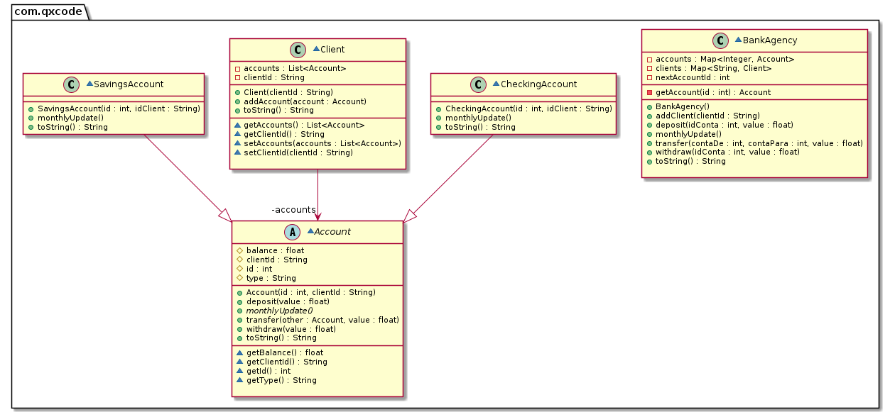

# Cadastro - Agência 2 (herança, método abstrato, polimorfismo)


<!--TOC_BEGIN-->
- [Requisitos](#requisitos)
- [Shell](#shell)
- [Diagrama](#diagrama)
- [Esqueleto](#esqueleto)
<!--TOC_END-->

O objetivo dessa atividade é implementar uma agência bancária simplificada. Deve ser capaz de cadastrar cliente. Cada cliente inicia com uma conta poupança e uma conta corrente. Contas correntes tem taxa de administração e contas poupanças rendem juros.

## Requisitos

- Cadastrar um cliente com idCliente único
    - Quando o cliente é cadastrado no sistema, automaticamente é aberta uma conta corrente e uma conta poupança para ele.
- Mensalmente:
    - Contas corrente vão receber uma tarifa de 20 reais podendo inclusive ficar negativas.
    - Contas poupança vão aumentar de 1 porcento.
- Sua agência deve ter uma "lista" de clientes e de contas.
    - A lista pode ser linear ou usando mapas.
- O cliente só tem duas contas, mas imagine que no futuro ele poderá ter várias.
- As contas devem ser tratadas utilizando polimorfismo.


## Shell

```bash
#__case first clients
# addCli _idCliente
# adiciona um cliente na lista de clientes.
# cria uma conta poupança e uma conta corrente para cada cliente usando numeração de forma sequencial.
$addCli Almir
$addCli Julia
$addCli Maria

# show mostra as contas do banco, com id:usuario:saldo:tipo
# em tipo use CC para conta corrente e CP para conta poupança.
$show
Clients:
- Almir [0, 1]
- Julia [2, 3]
- Maria [4, 5]
Accounts:
0:Almir:0.00:CC
1:Almir:0.00:CP
2:Julia:0.00:CC
3:Julia:0.00:CP
4:Maria:0.00:CC
5:Maria:0.00:CP

######################################
#__case operações básicas
#faça as operações básicas de saque, depósito e transferência entre contas
#verifique se as contas existem antes de efetuar as operações
# $saque _conta _value
# para sacar verifique o saldo
#
# $deposito _conta _value
#
# $transf _contaDe _contaPara _value

$deposito 0 100
$deposito 1 200
$deposito 2 50
$deposito 3 300
$saque 3 50
$saque 0 70
$saque 1 300
fail: saldo insuficiente

$show
Clients:
- Almir [0, 1]
- Julia [2, 3]
- Maria [4, 5]
Accounts:
0:Almir:30.00:CC
1:Almir:200.00:CP
2:Julia:50.00:CC
3:Julia:250.00:CP
4:Maria:0.00:CC
5:Maria:0.00:CP

$transf 3 5 200
$transf 0 4 25
$transf 9 1 30
fail: conta nao encontrada
$transf 2 8 10
fail: conta nao encontrada

$show
Clients:
- Almir [0, 1]
- Julia [2, 3]
- Maria [4, 5]
Accounts:
0:Almir:5.00:CC
1:Almir:200.00:CP
2:Julia:50.00:CC
3:Julia:50.00:CP
4:Maria:25.00:CC
5:Maria:200.00:CP

#__case update mensal
# No comando update todas as contas serão atualizadas.
# Contas corrente vão receber uma tarifa de 20 reais podendo inclusive ficar negativas.
# Contas poupança vão aumentar de 1 porcento.
$update

$show
Clients:
- Almir [0, 1]
- Julia [2, 3]
- Maria [4, 5]
Accounts:
0:Almir:-15.00:CC
1:Almir:202.00:CP
2:Julia:30.00:CC
3:Julia:50.50:CP
4:Maria:5.00:CC
5:Maria:202.00:CP
$end

$end

```

***
## Diagrama



***
## Esqueleto
<!--FILTER Solver.java java-->
```java
//excessão lançada em quaisquer erros relacionados à conta
class AccountException extends RuntimeException {
    public AccountException(String message) {
        super(message);
    }
}
abstract class Account {
    protected int id;
    protected float balance;
    protected String clientId;
    protected String type; //CC or CP
    public Account(int id, String clientId);
    //abstract method
    public abstract void monthlyUpdate();
    //saque
    public void withdraw(float value);
    //deposito
    public void deposit(float value);
    //transferencia para outra conta
    public void transfer(Account other, float value);
    public String toString();
    //GETS and SETS
    int getId();
    float getBalance();
    String getClientId();
    String getType();
}
class CheckingAccount extends Account {
    //inicializa conta.type com "CC"
    public CheckingAccount(int id, String idClient);
    //retira 20 do saldo
    public void monthlyUpdate();
}
class SavingsAccount extends Account {
    public SavingsAccount(int id, String idClient);
    //aumenta saldo em 1%
    public void monthlyUpdate();
}
class Client {
    private String clientId;
    private List<Account> accounts;
    public Client(String clientId);
    public void addAccount(Account account);
    public java.lang.String toString();
    //GETS and SETS
    String getClientId();
    void setClientId(String clientId);
    List<Account> getAccounts();
    void setAccounts(List<Account> accounts);
};
class BankAgency {
    private Map<String, Client> clients;
    private Map<Integer, Account> accounts;
    private int nextAccountId = 0;
    //obtém conta ou lança excessão
    private Account getAccount(int id);
    public BankAgency();
    //se o cliente não existir
    //cria o cliente
    //cria uma conta poupança e uma conta corrent para o cliente
    //adiciona essas contas no vetor de contas e no vetor do cliente
    //adiciona o cliente no mapa de clientes
    public void addClient(String clientId);
    //obtem o cliente e invoca as ações
    public void withdraw(int idConta, float value);
    public void deposit(int idConta, float value);
    public void transfer(int contaDe, int contaPara, float value);
    public void monthlyUpdate();
    public String toString();
};
class Solver{
    public static void main(String[] args) {
        Scanner scanner = new Scanner(System.in);
        BankAgency agency = new BankAgency();
        while(true){
            try {
                String line = scanner.nextLine();
                System.out.println("$" + line);
                String ui[] = line.split(" ");
                if(line.equals("end")) {
                    break;
                } else if(ui[0].equals("show")) {
                    System.out.println(agency);
                } else if(ui[0].equals("addCli")) {
                    agency.addClient(ui[1]);
                } else if(ui[0].equals("saque")) { //accountId value
                    agency.withdraw(Integer.parseInt(ui[1]), Float.parseFloat(ui[2]));
                } else if(ui[0].equals("deposito")) {//accountId value
                    agency.deposit(Integer.parseInt(ui[1]), Float.parseFloat(ui[2]));
                } else if(ui[0].equals("transf")) {//from to value
                    agency.transfer(Integer.parseInt(ui[1]), Integer.parseInt(ui[2]), Float.parseFloat(ui[3]));
                } else if(ui[0].equals("update")) {
                    agency.monthlyUpdate();
                } else {
                    System.out.println("fail: comando invalido");
                }
            } catch (AccountException ae) {
                System.out.println(ae.getMessage());
            }
        }
        scanner.close();
    }
}
```
<!--FILTER_END-->
