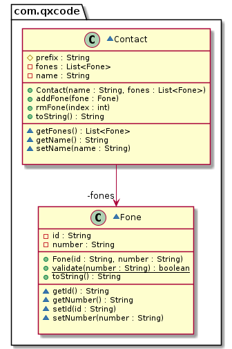

# Contato - Agenda 1


<!--TOC_BEGIN-->
- [Requisitos](#requisitos)
- [Shell](#shell)
- [Diagrama UML](#diagrama-uml)
- [Ajuda](#ajuda)

<!--TOC_END-->


O objetivo dessa atividade é implementar uma classe responsável por guardar um **único** contato da agenda telefônica do seu celular. Cada contato pode ter vários telefones.

## Requisitos
Seu programa deve:

- **Definir nome**
    - Poder inicializar o contato passando o nome.
        - Se já houver contato, inicie um novo contato.
        - Se não houver nome, o nome default é "".
- **Inserir telefones no contato** 
    - Um telefone tem um label e um fone.
    - Labels serão nomes como: casa, fixo, oi.
    - Labels podem ser duplicados.
    - Adapte o print para apresentar os índices.
```sh
# Exemplo de saída
- ana [0:tim:3434] [1:casa:4567] [2:oi:8754] [3:casa:4567] [4:oi:8754]
```

- **Remover telefones do contato.**    
    - Remove os celulares pelo indice.
    - Os índices dos números restantes devem ser atualizados.
- **Validando os números de telefone.**
    - Processe os telefones para apenas permitir nos telefones os seguintes caracteres "0123456789()."
    - Se o usuário tentar inserir individualmente um telefone invalido, avise e não insira o telefone.

***
## Shell

```bash
#__case definindo nome
$init david
$show
- david

#__case inserindo telefones
$add oi 88
$add tim 99
$add tim 98
$add vivo 83
$show
- david [0:oi:88] [1:tim:99] [2:tim:98] [3:vivo:83]

#__case removendo telefone por indice
$rm 2
$show
- david [0:oi:88] [1:tim:99] [2:vivo:83]
$rm 0
$show
- david [0:tim:99] [1:vivo:83]

#__case validando numero de fone
$add tim 9a9
fail: fone invalido
$add tim (85)99.99
$show
- david [0:tim:99] [1:vivo:83] [2:tim:(85)99.99]
$end
#__end__
```

***
## Diagrama UML



## Ajuda
- Utilize uma estrutura linear como vector(c++) ou ArrayList(Java) para guardar os telefones.